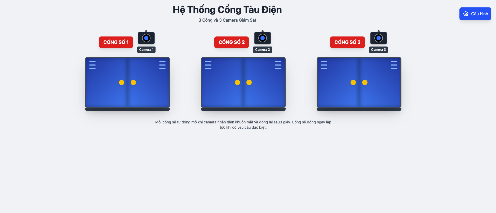
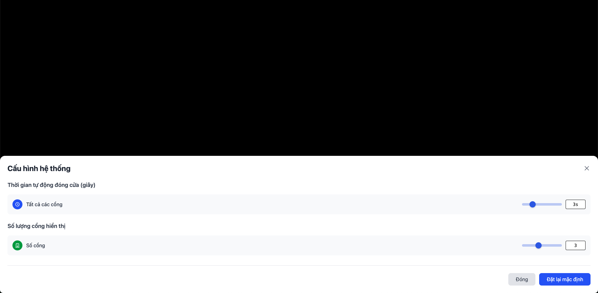

# Electric Train Gate System (Hệ Thống Cổng Tàu Điện)

A React application for monitoring and controlling an electric train gate system with 3 gates and 3 surveillance cameras.



## Features

- **3 Gates with Cameras**: Each gate has face recognition capability
- **Automatic Control**: Gates open on face detection and close after 3 seconds
- **Real-time Monitoring**: WebSocket connection for live events
- **System Configuration**: Adjustable settings for gate behavior



## System Behavior

> "Mỗi cổng sẽ tự động mở khi camera nhận diện khuôn mặt và đóng lại sau 3 giây. Cổng sẽ đóng ngay lập tức khi có yêu cầu đặc biệt."

_Each gate automatically opens when the camera detects a face and closes after 3 seconds. Gates close immediately for special requests._

## Usage

```bash
npm run dev
```

## API Endpoints

- **Test Broadcast**: `POST http://localhost:8000/api/v1/webhook/test-broadcast`
- **Gate Access**: `POST http://localhost:8000/api/v1/webhook/gate-access`
- **Trigger Access**: `POST http://localhost:8000/api/v1/gates/access`

## Technologies

- React 19 + TypeScript
- Tailwind CSS
- WebSocket API
- Vietnamese localization
